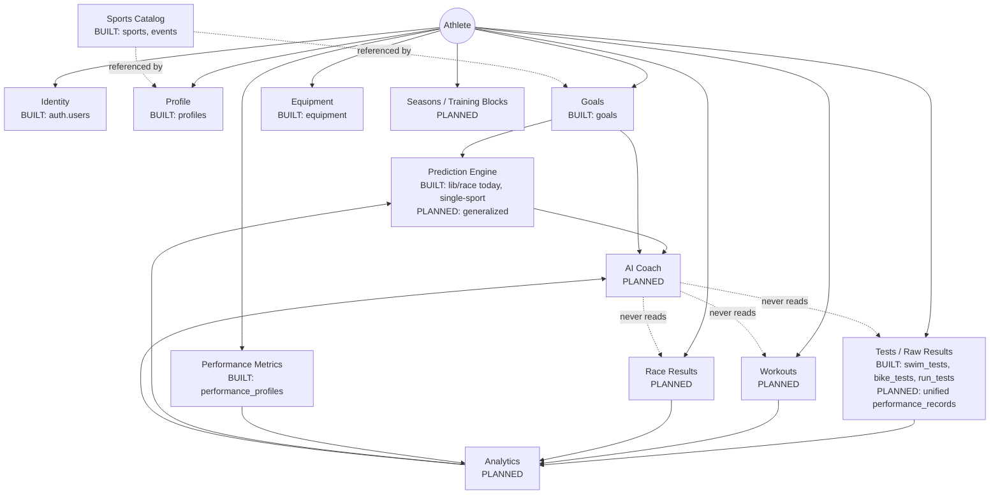
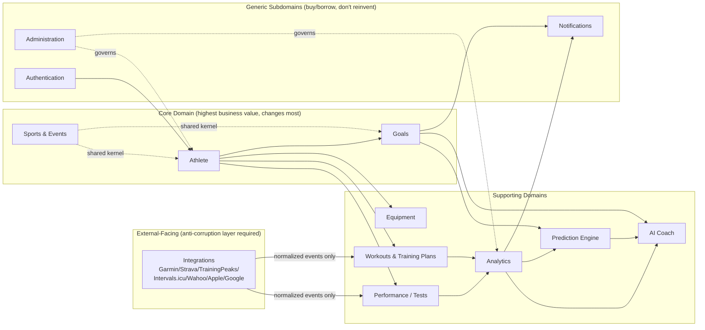

# Athlete Performance Platform — Architecture

## Status of this document

This is the platform's authoritative architecture reference. It describes
two things side by side, always labeled:

- **BUILT** — exists in this repo today, described accurately, not
  aspirationally.
- **PLANNED** — target state this document argues for. Not yet code.

Where the two differ, BUILT wins as ground truth and PLANNED is the
committed direction. Section 8 (Migration Strategy) is the bridge between
them.

## Vision

The product started as **SUB-60 Sprint Performance Lab** — a personal tool
for one Sprint Triathlon target (Swim 400m / Bike 10km / Run 2.5km, finish
under 60 minutes). That goal still exists, but it is no longer special-cased
anywhere in the domain. It is **one seeded Goal Pack**: a Sport
("Triathlon"), an Event ("Super Sprint"), and a Goal Level ("Sub-60") sitting
in the same configurable catalog as every other sport, event, and goal the
platform will ever support.

The platform is now the **Athlete Performance Platform**: a system for any
endurance athlete — Swimming, Cycling, Running, Triathlon, Duathlon,
Aquathlon today; XC Ski, Rowing, Trail Running, Ultra Running tomorrow —
built so that "tomorrow" never requires touching the architecture, only
adding data to it.

---

## 1. Complete Domain Diagram

Everything hangs off **Athlete**. Nothing in the system exists without an
owning athlete except the reference catalogs (Sports, Events, Goal Levels),
which are shared, seeded configuration — not per-athlete data.



Reading this diagram: solid arrows are ownership or "feeds into" (write
paths and read paths for computation). Dotted arrows are read-only
references. The dotted lines out of AI Coach are the platform's hardest
rule, stated explicitly in Section 7 and enforced by construction, not by
convention: **the AI Coach has no code path to a raw table.**

---

## 2. Bounded Context Diagram



**Context relationships, named explicitly (DDD context mapping):**

| Upstream | Downstream | Relationship |
|---|---|---|
| Sports & Events | Athlete, Goals | **Shared Kernel** — both depend on the same catalog identifiers |
| Authentication | Athlete | **Customer/Supplier** — Athlete profile is created on top of an auth identity it doesn't own |
| Performance, Workouts | Analytics | **Conformist** — Analytics consumes their data shapes as-is |
| Analytics, Prediction, Goals | AI Coach | **Open Host Service** — a stable, intentionally narrow read API; AI Coach is not allowed to reach past it |
| Integrations | Performance, Workouts | **Anti-Corruption Layer** — every external provider's format is translated into internal entities at the boundary; internal domain never sees a Garmin/Strava-shaped object |
| Administration | everything | **Governance** — flags, audits, overrides; no business logic lives here |

---

## 3. Database Modules

Physically one Postgres database today (Supabase) — logically partitioned
into modules. Each module is owned by exactly one bounded context; no other
context writes into it directly.

### Identity & Athlete *(BUILT)*
- `auth.users` — Supabase-managed.
- `profiles` — the Athlete aggregate root. `id` (uuid) deliberately distinct
  from `user_id`, reserving room for one account to own multiple athlete
  profiles (coach, family plan) without a schema change.

### Catalog *(BUILT)*
- `sports` — text-keyed reference table (`swimming`, `cycling`, ...,
  extensible to `xc_ski`, `rowing`, `ultra_running`, ... with zero code
  changes).
- `events` — per-sport event definitions, including a first-class `Custom`
  row per sport so athletes can define events the catalog hasn't
  anticipated. `kind` distinguishes a race distance from a test protocol
  (e.g. Cycling's FTP Test).

### Goals *(BUILT)*
- `goals` — always resolves to a curated `level_key` (against a code-level
  goal ladder) or an explicit `custom_target_value`, enforced by a check
  constraint. Supports the full goal vocabulary requested (Finish, Sub
  Time, Power, Pace, Heart Rate, Weight, Body Composition, CSS, FTP) because
  a goal's target is a bare number + unit, not a triathlon-specific field.

### Equipment *(BUILT)*
- `equipment` — one row per athlete, nullable throughout.

### Performance Metrics *(BUILT)*
- `performance_profiles` — self-reported/derived physiological baseline
  (FTP, CSS, VO2max, HR zones). One row per athlete, distinct from raw
  test history.

### Tests / Raw Results *(BUILT today, PLANNED generalization)*
- **Built:** `swim_tests`, `bike_tests`, `run_tests` — one table per
  discipline. This was the right call for a 3-discipline single-sport app;
  it does **not** scale to "add XC Ski without redesign," because every new
  discipline currently means a new table, a new service, a new type.
- **Planned:** a single `performance_records` table — `(id, profile_id,
  discipline, metric_type, value, unit, recorded_at, source, metadata
  jsonb)`. One schema for every discipline and every metric (time,
  distance, power, HR, pace, SWOLF, whatever a future discipline needs),
  discriminated by `metric_type` rather than by table. This is also the
  entity that must survive to 10M+ rows — see Section 10.

### Workouts & Training *(PLANNED)*
- `workout_templates` — reusable prescriptions, not tied to a date.
- `workouts` — a scheduled/completed instance of a template (or freeform),
  tied to a `training_week`.
- `training_weeks` → `training_blocks` → `training_cycles` → `seasons` —
  a strict containment hierarchy, each level aggregating the one below for
  planning and analytics roll-up.

### Race Results *(PLANNED)*
- `race_results` — an actual outcome against a specific `event_id`,
  distinct from a `goal` (the target) and a `performance_record` (a
  training data point). Splits stored as a `LegSplit[]`-shaped jsonb
  column, mirroring `lib/race/models.ts`.

### Analytics *(PLANNED)*
- `analytics_snapshots` — **precomputed**, not queried live from raw
  tables: PB, trend, consistency, fatigue, fitness, performance score,
  readiness, improvement rate, one row per athlete per metric per period.
  This table is what makes Section 10's scale numbers a non-issue.

### Prediction *(BUILT, single-sport; PLANNED generalization)*
- **Built:** `lib/race/` — a pure, in-process Triathlon race predictor
  (Riegel projections, confidence scoring, what-if analysis). No DB table;
  it's a calculation over `swim_tests`/`bike_tests`/`run_tests`.
- **Planned:** `predictions` cache table — `(profile_id, event_id, model,
  version, result jsonb, computed_at)` — so predictions become a read, not
  a recompute, and the algorithm can evolve (`model`/`version`) without
  losing history.

### AI Coach *(PLANNED)*
- No tables of its own beyond a `coaching_conversations` /
  `coaching_recommendations` log for auditability. It has no foreign key
  to any raw table by design.

### Notifications *(PLANNED)*
- `notifications`, `notification_preferences`.

### Integrations *(BUILT: import only; PLANNED: full)*
- **Built:** `lib/parser/`, `lib/normalizers/`, `services/import.service.ts`
  — a manual Garmin CSV pipeline (parse → detect → normalize → validate →
  save).
- **Planned:** `integration_connections` (OAuth tokens per provider, per
  athlete), `sync_jobs` / `sync_logs`, and a `raw_import_payloads` landing
  table — every external payload lands here unmodified before the
  anti-corruption layer normalizes it into `performance_records` /
  `workouts`. This makes every integration bug replayable against the
  original payload instead of "the data's just wrong now."

### Administration *(PLANNED)*
- `audit_log`, `feature_flags`, `admin_roles`.

---

## 4. Folder Structure

**Today (BUILT)** — a pragmatic functional-core layout, not yet
context-partitioned:

```
app/            UI routes only (Next.js App Router)
components/     Reusable + feature UI (components/onboarding/, components/import/)
hooks/          Client data-fetching + state (useDashboard, useOnboarding, useAthlete, ...)
services/       Supabase I/O, one file per table/aggregate
lib/
  sports/       Sport & Event catalog (pure)
  goals/        Goal ladder catalog (pure)
  athlete/      Derivations over Athlete + catalog (pure)
  race/         Triathlon-specific prediction engine (pure)
  analytics/    Per-discipline analytics (pure)
  parser/ normalizers/ validators/   Garmin import pipeline (pure)
  format/       Display formatting
types/          Shared TS types, one file per aggregate
supabase/       Migrations
```

This has served well because the app is still small enough that "one
service per table" and "one lib folder per pure concern" are easy to
navigate. It stops working once a single context (Workouts, say) needs its
own multi-file domain/application/infrastructure split, or once two
contexts need genuinely independent deploy lifecycles.

**Target (PLANNED)** — bounded-context-first, each context internally
layered (see Section 6):

```
src/
  contexts/
    athlete/
      domain/          entities, value objects, invariants
      application/      use cases (CreateAthlete, CompleteOnboarding, ...)
      infrastructure/    Supabase repositories
      interface/         hooks + route handlers this context exposes
    sports/
    goals/
    equipment/
    performance/
    workouts/
    analytics/
    prediction/
    ai-coach/
    notifications/
    integrations/
      providers/garmin/ strava/ training-peaks/ intervals-icu/ wahoo/ apple-health/ google-fit/
      landing/           raw payload staging + ACL translators
    administration/
  shared-kernel/
    catalog/            Sports/Events/Goal-Level identifiers everyone reads
    value-objects/       Distance, Duration, Pace, Power, HeartRate
  platform/
    supabase/
    auth/
    queue/
app/            (unchanged — thin route layer calling into contexts/*/interface)
```

The move from today's structure to this one is **Section 8, not a rewrite**
— folders are renamed and regrouped module-by-module as each context earns
its own lifecycle, never as a big-bang restructure.

---

## 5. Future Microservice Split

The monolith is correct today and should remain correct for a long time —
splitting services prematurely is the single most common way mid-stage
SaaS platforms destroy their own velocity. Split only when a context has a
**genuinely different scaling, reliability, or deployment profile** from
the core. In likely order:

1. **Integrations** — first to split. Different failure domain (a
   Garmin/Strava outage or rate limit must never slow down the core app),
   different scaling shape (bursty webhook/polling traffic, not
   user-request-shaped), and a natural boundary already exists (the
   anti-corruption layer). Runs as a worker/queue consumer.
2. **Analytics + Prediction (batch/compute)** — second. Recomputing
   snapshots and predictions is CPU-bound, asynchronous, and horizontally
   parallelizable per athlete — nothing like the request/response core.
   The *read* side (serving precomputed snapshots) stays in the monolith;
   the *compute* side (producing them) becomes a background service.
3. **AI Coach** — third. Different cost model (LLM tokens), different
   latency profile (seconds, not milliseconds), different vendor
   dependency. Isolating it means a provider outage or cost spike never
   touches the core app's availability.
4. **Notifications** — fourth, once fan-out volume (email/push/SMS across
   100k+ athletes) makes in-process delivery a bottleneck. Naturally
   event-driven, easy to peel off once domain events exist (Section 7).

**Stays in the monolith longest:** Athlete, Sports & Events, Goals,
Equipment. These are low-volume, highly relational, transactional, and
benefit far more from being co-located (simple joins, single-transaction
consistency) than they would from independent scaling. There is no
10-year plan in which Goals needs to scale differently from Athlete.

---

## 6. Recommended Clean Architecture

Four layers, dependencies point inward only — outer layers know about
inner layers, never the reverse.

```
┌─────────────────────────────────────────────┐
│ Interface        app/, components/, hooks/    │  Next.js routes, React, presentation
├─────────────────────────────────────────────┤
│ Application      services/*.service.ts        │  Use-case orchestration, transactions
├─────────────────────────────────────────────┤
│ Domain           lib/<context>/*              │  Entities, value objects, pure rules
├─────────────────────────────────────────────┤
│ Infrastructure   lib/supabase.ts, integrations│  DB client, external APIs, queues
└─────────────────────────────────────────────┘
```

- **Domain** (`lib/sports`, `lib/goals`, `lib/athlete`, `lib/race`,
  `lib/analytics`) never imports Supabase, React, or Next.js — verified
  today by construction (these modules take plain data in, return plain
  data out). This is why the Prediction Engine can run in a background
  worker tomorrow with zero code changes: it never depended on the web
  framework to begin with.
- **Application** (`services/*.service.ts`) is the only layer allowed to
  call Supabase. It orchestrates domain logic + persistence but contains
  no business rules of its own — a service function reads like a
  sequence of verbs, not a decision tree.
- **Interface** (`app/`, `components/`, `hooks/`) renders and collects
  input. It calls services and hooks; it never queries Supabase directly
  and never contains a calculation.
- **Infrastructure** is swappable in principle: Supabase today, but
  nothing in Domain or (ideally) Application hard-depends on Postgres-
  specific behavior beyond the repository functions themselves.

This is already the discipline this codebase has followed since the first
commit (see the "Development Rule" at the bottom of this document) — Clean
Architecture here is a name for a rule that already exists, not a new one.

---

## 7. Recommended DDD Architecture

### Aggregates and their roots

| Aggregate Root | Owns (same transaction boundary) | References (by id only) |
|---|---|---|
| **Athlete** (`profiles`) | — | Sport, Event |
| **Goal** | — | Athlete, Event, GoalLevel |
| **Equipment** | — | Athlete |
| **PerformanceProfile** | — | Athlete |
| **PerformanceRecord** *(planned)* | — | Athlete, Discipline |
| **Workout** *(planned)* | WorkoutSegments | Athlete, TrainingWeek, WorkoutTemplate |
| **TrainingSeason** *(planned)* | TrainingCycles → TrainingBlocks → TrainingWeeks | Athlete |
| **RaceResult** *(planned)* | LegSplits | Athlete, Event |

Each aggregate is its own consistency boundary: a `Goal` never embeds a
copy of `Athlete` fields, it holds `profile_id`. This is why Section 3's
tables are narrow and numerous rather than wide — narrow aggregates are
what let contexts evolve (and eventually deploy) independently.

### Value Objects

Not entities — no identity, defined entirely by their value, always
immutable:

- **Distance** (`{ value, unit: "m" | "km" | "mi" }`)
- **Duration** (`seconds`, with formatting behavior — already exists as
  `lib/format/time.ts`, promotable to a real value object)
- **Pace** (`Duration` per `Distance` unit)
- **Power** (`watts`)
- **HeartRateZone** (`{ min, max, zone }`)
- **GoalTarget** (a `GoalLevel` reference *or* a raw number + unit — the
  exact shape `goals.level_key` / `goals.custom_target_value` already
  encode)

### Domain Events *(planned — the backbone of cross-context decoupling)*

Contexts should communicate by publishing facts, not by calling each
other's internals:

- `TestRecorded` → triggers Analytics recomputation for that athlete/metric
- `WorkoutCompleted` → triggers Analytics + (eventually) Training Plan
  adaptation
- `GoalCreated` / `GoalAchieved` → triggers Notifications, and invalidates
  cached Predictions
- `RaceCompleted` → triggers Analytics, Goal progress re-evaluation,
  Notifications
- `IntegrationSynced` → triggers normalization into `performance_records`
  / `workouts`

Implementable inside the monolith today as an `outbox` table + a
polling worker — no message broker required until a context actually
splits out (Section 5). This is the mechanism that finally makes the "AI
Coach never reads raw tables" rule *structural*: AI Coach isn't tempted to
join against `performance_records` because it never needed a domain event
about it — it only ever listens for `AnalyticsSnapshotUpdated` and
`PredictionUpdated`.

---

## 8. Migration Strategy

Each phase has a **trigger**, not a date. Do not start a phase early
because it's "next on the list" — start it when its trigger fires.

| Phase | Trigger | Work |
|---|---|---|
| **0 — done** | — | Athlete/Sports/Events/Goals/Equipment/PerformanceProfile modules built and normalized; onboarding UI *pending adaptation* to this shape |
| **1** | A second discipline needs a new metric type not in swim/bike/run tests, **or** a non-triathlon sport (Rowing, XC Ski) is scheduled | Introduce `performance_records`; migrate `swim_tests`/`bike_tests`/`run_tests` into it behind a compatibility view so `lib/analytics/*` doesn't break in the same release |
| **2** | Onboarding UI is rebuilt against Phase-0's schema | Workouts, Training Plans, Seasons, Race Results modules |
| **3** | Any dashboard query starts scanning raw performance data live (i.e. now, in spirit — do this before it's a problem) | Analytics snapshot table + nightly/on-event recompute job; generalize `lib/race/` into a discipline-agnostic Prediction Engine with a `predictions` cache |
| **4** | First real request for Strava/TrainingPeaks/etc. (beyond manual Garmin CSV) | `integration_connections`, `sync_jobs`, landing-zone `raw_import_payloads`, formal anti-corruption layer per provider |
| **5** | AI Coach feature is scheduled | Domain events / outbox table; AI Coach reads only Analytics + Prediction + Goals |
| **6** | Integrations sync volume measurably degrades core app latency or deploy cadence | Extract Integrations as its own service (first microservice) |
| **7+** | Analytics/Prediction compute time competes with user-facing request latency | Extract Analytics/Prediction compute workers |

**Non-negotiable rule across every phase:** a phase never breaks the
phase before it. Phase 1's `performance_records` migration ships with the
old tables still readable (view or dual-write) until every consumer is
migrated — no "big bang cutover with a maintenance window" for a platform
that intends to have paying athletes on it.

---

## 9. Growth Strategy

Technical levers, applied in the order the platform actually needs them —
not all at once:

1. **Indexing before infrastructure.** Composite indexes on
   `(profile_id, recorded_at)` / `(profile_id, event_id)` solve 90% of
   "it's slow now" complaints. Do this before reaching for anything below.
2. **Precomputation over live aggregation.** Analytics snapshots (Section
   3) mean a dashboard load is always a handful of indexed point-reads,
   never a scan-and-aggregate over raw history, regardless of how much
   history exists.
3. **Background jobs for anything non-interactive.** Snapshot
   recomputation, prediction refresh, integration sync — all queue-driven
   (Supabase Edge Functions / pg-boss / equivalent), never inline with a
   user request.
4. **Read replica for analytics-shaped queries** once the write path
   (recording tests/workouts, updating goals) starts contending with the
   read path (dashboards, coaching, exports) on the same instance.
5. **Partitioning for time-series tables** (`performance_records`,
   eventually `workouts`) by month or by `profile_id` hash once single-
   partition size starts hurting vacuum/index-maintenance time — not
   before; premature partitioning adds operational cost for no benefit at
   today's scale.
6. **Connection pooling (PgBouncer/Supavisor)** as concurrent athlete
   count grows past what direct Postgres connections comfortably serve.
7. **Caching (edge/CDN + in-memory)** for read-heavy, low-personalization
   content (sport/event catalog, public leaderboards if ever built) —
   this data changes rarely and is identical for every athlete, the
   textbook cache case.
8. **Multi-region: deliberately deferred.** Nothing in this architecture
   blocks it later (every aggregate is already partitioned by
   `profile_id`), but it solves a latency problem this platform does not
   yet have. Building for it now is the "designing for a scale you don't
   have" failure mode.

---

## 10. Why This Holds at 100k Athletes / 1M Workouts / 10M Performance Records

Walking through each number against the architecture above, not in the
abstract:

**100,000 athletes** → 100,000 rows in `profiles`, and a small multiple of
that in `goals`/`equipment`/`performance_profiles` (a handful of rows
each, per athlete). This is trivial for a single Postgres instance —
nowhere near a scale where `profiles` itself needs any special treatment.
The only thing that must scale with athlete count is concurrency
(simultaneous connections), handled by lever 6 in Section 9, not by
sharding the table.

**1,000,000 workouts** → comfortably index-served (`profile_id`,
`scheduled_date`) on one Postgres instance; Postgres routinely serves
tables an order of magnitude larger than this without partitioning.
Workouts are also naturally scoped by `training_week`/`season`, so any
query pattern the product actually needs ("this week's plan," "this
season's log") is already narrow by construction — nothing forces a full-
table scan.

**10,000,000 performance records** → the one number that requires an
explicit answer, and Section 3/8/9 already gave it:

- The raw `performance_records` table is written to constantly but **read
  from directly almost never** — Analytics reads precomputed snapshots
  (Section 3), not raw rows. 10M rows is a write-throughput and storage
  question, not a page-load-latency question, because no user-facing
  request touches all 10M rows, or even a meaningful fraction of them.
- When the raw table *is* read (the nightly/on-event snapshot job), it's
  read in bounded, indexed slices — "this athlete's records since their
  last snapshot" — never "all records."
- Partitioning by month (lever 5) keeps any single partition small enough
  that indexing, vacuuming, and backups stay fast, and lets old partitions
  be moved to cheaper storage or rolled up into permanent
  monthly/yearly summaries once their detail is no longer analytically
  useful.
- The **AI Coach never touches this table at all** (Section 1's dotted
  lines, Section 7's Open Host Service rule). Its context size, latency,
  and cost are bounded by Analytics/Prediction/Goal summaries regardless
  of whether the platform has 10M or 100M performance records underneath
  — this is precisely why that rule exists, not merely a cleanliness
  preference.

The pattern underneath all three numbers is the same: **every context
reads the smallest, most-specific slice of data that answers its
question**, because the domain model (narrow aggregates, precomputed
analytics, event-driven cross-context communication) was designed so that
"smallest slice" is always available, never "the whole table, filtered
client-side."

---

## Development Rule

Every new feature must answer:

- Which bounded context owns this data?
- Which aggregate is the consistency boundary?
- Which service reads/writes it, and does that service call Supabase
  directly (it should be the only thing that does)?
- Which domain module computes derived values from it (and does that
  module stay free of Supabase/React)?
- Does anything outside this feature need to know when it happens — and
  if so, is that a domain event, not a direct cross-context call?

No duplicated logic. No direct Supabase calls inside pages. No context
reaching into another context's tables.
